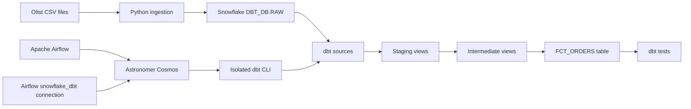
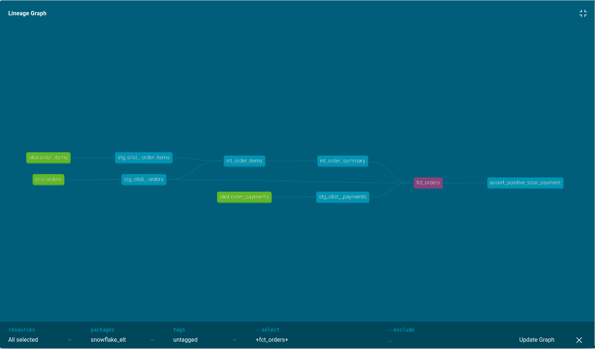
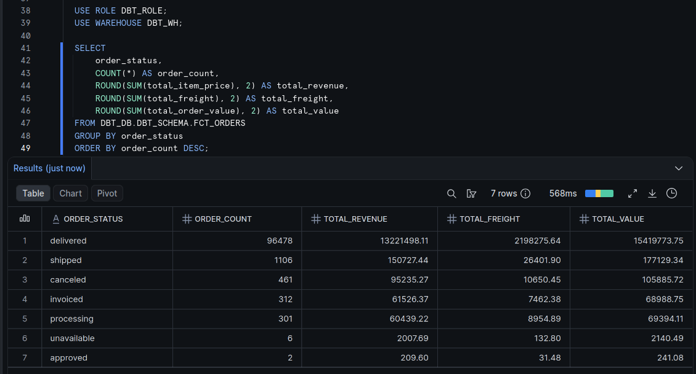
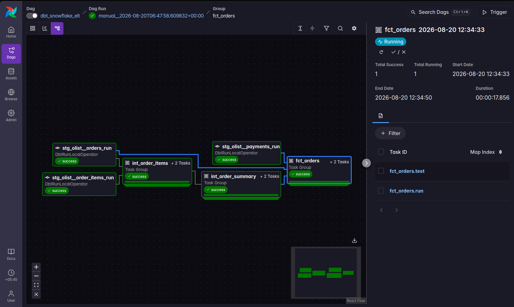

# dbt + Snowflake + Airflow ELT Pipeline

A complete, locally orchestrated ELT pipeline built with Snowflake, dbt Core, Apache Airflow, Astronomer Cosmos, and Docker. The project loads the Brazilian E-Commerce Public Dataset by Olist into Snowflake, transforms it through clear dbt model layers, validates it with data-quality tests, and orchestrates the dbt dependency graph as individual Airflow tasks.

## Project outcome

The completed pipeline:

- Loads four Olist CSV files into a Snowflake `RAW` schema.
- Uses a dedicated `DBT_ROLE` instead of running transformations as `ACCOUNTADMIN`.
- Builds three staging views, two intermediate views, and one fact table.
- Uses dbt `source()`, `ref()`, a reusable macro, generic tests, and a singular test.
- Produces an analytics-ready `FCT_ORDERS` table with 98,666 rows.
- Passes all 17 resources in `dbt build` with no warnings or errors.
- Uses Cosmos to translate dbt dependencies into an Airflow task graph.
- Completes a manually triggered Airflow DAG run successfully.

## Architecture



The data and orchestration flows have separate responsibilities:

```text
Data flow:          CSV → Snowflake RAW → staging → intermediate → mart
Orchestration flow: Airflow → Cosmos → dbt CLI → Snowflake
```

## Technology stack

| Technology | Responsibility |
|---|---|
| Snowflake | Stores raw data and transformed warehouse objects |
| dbt Core | Defines SQL transformations, lineage, materializations, and tests |
| Apache Airflow | Controls execution order, task state, retries, and logs |
| Astronomer Cosmos | Converts the dbt graph into Airflow tasks and task groups |
| Astro CLI | Builds and runs the local containerized Airflow environment |
| Docker | Provides a reproducible Airflow and dbt runtime |
| Python and pandas | Load the local CSV files into Snowflake |

## Data model

### Raw sources

The ingestion script loads these files into `DBT_DB.RAW`:

| CSV file | Snowflake table | Approximate rows |
|---|---:|---:|
| `olist_orders_dataset.csv` | `ORDERS` | 99,441 |
| `olist_order_items_dataset.csv` | `ORDER_ITEMS` | 112,650 |
| `olist_order_payments_dataset.csv` | `ORDER_PAYMENTS` | 103,886 |
| `olist_products_dataset.csv` | `PRODUCTS` | 32,951 |

The raw tables are declared as dbt sources rather than hard-coded relation names. This makes source dependencies, metadata, and source tests visible to dbt.

### Staging layer

The staging layer performs lightweight cleanup and type conversion:

| Model | Purpose | Materialization |
|---|---|---|
| `stg_olist__orders` | Standardizes order headers and timestamp types | View |
| `stg_olist__order_items` | Standardizes line-item identifiers and numeric values | View |
| `stg_olist__payments` | Standardizes payment records and values | View |

Staging models intentionally avoid joins and aggregations.

### Intermediate layer

| Model | Purpose | Materialization |
|---|---|---|
| `int_order_items` | Joins orders to line items and calculates item cost | View |
| `int_order_summary` | Aggregates item price, freight, and item count to order grain | View |

The reusable macro centralizes the item-cost formula:

```sql

    ({{ column_price }} + {{ column_freight }})

```

### Mart layer

`fct_orders` is the final analytics-ready table at one row per order with a line item. It combines:

- Order and customer identifiers
- Order status and lifecycle timestamps
- Item count
- Total item price
- Total freight
- Total order value
- Total payment value
- Number of distinct payment types

The mart is materialized as a table because it is the final consumer-facing output.

## dbt lineage

The lineage is derived from dbt `source()` and `ref()` calls:

```text
olist.orders ─────────→ stg_olist__orders ────────┐
                                                   ├→ int_order_items
olist.order_items ───→ stg_olist__order_items ────┘
                                                          ↓
                                                 int_order_summary
                                                          ↓
                                                     fct_orders

olist.order_payments → stg_olist__payments ───────────────┘
```



`PRODUCTS` is loaded and source-tested but is not referenced by a downstream model.

## Data quality

The project demonstrates two categories of dbt tests.

### Generic tests

Generic tests are declared in YAML and reused across sources and models:

- `unique` validates primary-grain identifiers.
- `not_null` validates required keys.
- `relationships` validates that order-item keys reference existing orders.

### Singular business-rule test

The singular test is a SQL query that must return zero failing rows:

```sql
select
    order_id,
    total_payment_value
from {{ ref('fct_orders') }}
where total_payment_value is not null
  and total_payment_value <= 0
```

The final build result was:

```text
1 table model
5 view models
11 data tests
PASS=17 WARN=0 ERROR=0 SKIP=0
```

## Snowflake result

The following validation query summarizes the fact table by order status:

```sql
SELECT
    order_status,
    COUNT(*) AS order_count,
    ROUND(SUM(total_item_price), 2) AS total_revenue,
    ROUND(SUM(total_freight), 2) AS total_freight,
    ROUND(SUM(total_order_value), 2) AS total_value
FROM DBT_DB.DBT_SCHEMA.FCT_ORDERS
GROUP BY order_status
ORDER BY order_count DESC;
```



## Airflow orchestration

The DAG uses `DbtDag` from Cosmos:

```python
dbt_snowflake_elt = DbtDag(
    dag_id="dbt_snowflake_elt",
    schedule=None,
    start_date=datetime(2025, 1, 1),
    catchup=False,
    project_config=ProjectConfig(
        DBT_PROJECT_PATH,
        install_dbt_deps=True,
    ),
    profile_config=profile_config,
    execution_config=ExecutionConfig(
        dbt_executable_path=DBT_EXECUTABLE_PATH,
    ),
    default_args={"retries": 1},
    tags=["dbt", "snowflake", "cosmos"],
)
```

Cosmos reads the dbt graph and creates the Airflow dependencies automatically. Independent staging models can run in parallel, while downstream models wait for their upstream dependencies.

The DAG uses `schedule=None` because the Olist dataset is static and this is a manually operated showcase. A daily schedule would create activity without a changing source.



## Repository structure

```text
dbt-snowflake-elt-pipeline/
├── dags/
│   └── dbt_snowflake_elt.py
├── docs/
│   └── images/
│       ├── airflow-dag-success.png
│       ├── dbt-lineage.png
│       └── snowflake-results.png
├── include/
│   └── dbt/
│       └── snowflake_elt/
│           ├── macros/
│           ├── models/
│           │   ├── intermediate/
│           │   ├── marts/
│           │   └── staging/olist/
│           ├── tests/
│           ├── dbt_project.yml
│           └── packages.yml
├── ingestion/
│   ├── data/                 # Local only; ignored by Git
│   └── upload_data.py
├── tests/dags/
│   └── test_dbt_snowflake_elt.py
├── .env.example
├── Dockerfile
├── packages.txt
├── requirements.txt
└── README.md
```

## Prerequisites

- Git
- Python 3.11 or later
- [uv](https://docs.astral.sh/uv/) or `pip`
- Docker Desktop or another Docker-compatible engine
- [Astro CLI](https://www.astronomer.io/docs/astro/cli/install-cli/)
- A Snowflake account
- A Kaggle account for the [Brazilian E-Commerce Public Dataset by Olist](https://www.kaggle.com/datasets/olistbr/brazilian-ecommerce)

## Local setup

### 1. Clone the repository

```bash
git clone https://github.com/pralov-malla/dbt-snowflake-elt-pipeline.git
cd dbt-snowflake-elt-pipeline
```

### 2. Create the local Python environment

Using `uv`:

```bash
uv venv
source .venv/bin/activate
uv pip install \
    "dbt-snowflake>=1.10.6,<2.0" \
    pandas \
    python-dotenv \
    "snowflake-connector-python[pandas]"
```

On Windows PowerShell, activate the environment with:

```powershell
.venv\Scripts\Activate.ps1
```

### 3. Provision Snowflake

Run the following as `ACCOUNTADMIN`, replacing the username placeholder:

```sql
USE ROLE ACCOUNTADMIN;

CREATE WAREHOUSE IF NOT EXISTS DBT_WH
    WAREHOUSE_SIZE = 'XSMALL'
    AUTO_SUSPEND = 60
    AUTO_RESUME = TRUE
    INITIALLY_SUSPENDED = TRUE;

CREATE DATABASE IF NOT EXISTS DBT_DB;
CREATE ROLE IF NOT EXISTS DBT_ROLE;

GRANT ROLE DBT_ROLE TO USER <YOUR_SNOWFLAKE_USERNAME>;
GRANT USAGE ON WAREHOUSE DBT_WH TO ROLE DBT_ROLE;
GRANT ALL PRIVILEGES ON DATABASE DBT_DB TO ROLE DBT_ROLE;

USE ROLE DBT_ROLE;

CREATE SCHEMA IF NOT EXISTS DBT_DB.RAW;
CREATE SCHEMA IF NOT EXISTS DBT_DB.DBT_SCHEMA;
```

`ACCOUNTADMIN` is used only for provisioning and grants. Normal loading and transformation work uses `DBT_ROLE`.

### 4. Download the dataset

Download and extract the Olist dataset from Kaggle. Copy these files into `ingestion/data/`:

```text
olist_orders_dataset.csv
olist_order_items_dataset.csv
olist_order_payments_dataset.csv
olist_products_dataset.csv
```

The CSV files are intentionally ignored by Git.

### 5. Configure local ingestion credentials

Copy the example environment file:

```bash
cp .env.example .env
```

Set the values in `.env`:

```dotenv
SNOWFLAKE_ACCOUNT=your_org-your_account
SNOWFLAKE_USER=your_username
SNOWFLAKE_PASSWORD=your_password
SNOWFLAKE_ROLE=DBT_ROLE
SNOWFLAKE_WAREHOUSE=DBT_WH
SNOWFLAKE_DATABASE=DBT_DB
SNOWFLAKE_SCHEMA=RAW
```

Never commit `.env`.

### 6. Load the CSV files

From the repository root:

```bash
python ingestion/upload_data.py
```

The script uppercases column names, creates or replaces the four raw tables, and prints row counts after upload.

### 7. Configure the local dbt profile

Create or update `~/.dbt/profiles.yml`:

```yaml
snowflake_elt:
  target: dev
  outputs:
    dev:
      type: snowflake
      account: YOUR_ORG-YOUR_ACCOUNT
      user: YOUR_USERNAME
      password: YOUR_PASSWORD
      role: DBT_ROLE
      warehouse: DBT_WH
      database: DBT_DB
      schema: DBT_SCHEMA
      threads: 4
```

This file lives outside the repository and must not be committed.

### 8. Build the dbt project

From the dbt project directory:

```bash
cd include/dbt/snowflake_elt
uv run dbt deps
uv run dbt debug
uv run dbt build
```

Alternatively, run from the repository root with an explicit project directory:

```bash
uv run dbt build --project-dir include/dbt/snowflake_elt
```

### 9. Generate dbt documentation

```bash
uv run dbt docs generate
uv run dbt docs serve
```

Open the displayed local URL and inspect the upstream lineage of `fct_orders`.

## Run with Airflow

### 1. Build and parse the Astro project

Return to the repository root and make sure Docker is running:

```bash
cd ../../..
docker info
astro dev parse
```

The Dockerfile creates a dedicated dbt environment inside the Airflow image:

```dockerfile
RUN python -m venv /usr/local/airflow/dbt_venv && \
    /usr/local/airflow/dbt_venv/bin/pip install \
        --no-cache-dir "dbt-snowflake>=1.10.6,<2.0"
```

This isolates dbt dependencies from Airflow dependencies.

### 2. Start Airflow

```bash
astro dev start
```

Open the Airflow URL printed by Astro.

### 3. Create the Airflow Snowflake connection

In Airflow, open **Admin → Connections** and create:

| Field | Value |
|---|---|
| Connection ID | `snowflake_dbt` |
| Connection Type | `Snowflake` |
| Login | Your Snowflake username |
| Password | Your Snowflake password |
| Schema | `DBT_SCHEMA` |

Use Extra JSON similar to:

```json
{
  "account": "YOUR_ORG-YOUR_ACCOUNT",
  "database": "DBT_DB",
  "warehouse": "DBT_WH",
  "role": "DBT_ROLE"
}
```

Cosmos converts this Airflow connection into a temporary dbt profile at runtime. Credentials remain in local Airflow metadata rather than the repository.

### 4. Trigger the pipeline

In the Airflow UI:

1. Open `dbt_snowflake_elt`.
2. Inspect the graph view.
3. Click **Trigger**.
4. Wait for the DAG run and task groups to become green.
5. Inspect task logs if a model or test fails.

### 5. Run DAG tests

```bash
astro dev pytest tests/dags/test_dbt_snowflake_elt.py
```

The tests verify that the DAG imports, exists with the expected ID, disables catch-up, uses one retry, and includes the project tags.

### 6. Stop the environment

```bash
astro dev stop
```

Stopping the local containers avoids unnecessary resource use. Snowflake's warehouse also auto-suspends after 60 seconds of inactivity.

## Security and engineering decisions

### Dedicated role

Transformations run using `DBT_ROLE`, not `ACCOUNTADMIN`. The admin role is only needed to create resources and grant access.

### Credentials outside Git

- Local ingestion credentials live in ignored `.env`.
- Local dbt credentials live in `~/.dbt/profiles.yml`.
- Airflow credentials live in the local Airflow connection store.
- No password is embedded in SQL, Python, the DAG, or this README.

### Materialization strategy

- Staging and intermediate models are views to avoid unnecessary data duplication.
- The final mart is a table for straightforward analytics consumption.

### Manual orchestration

The Airflow DAG is manually triggered because the source dataset is static. Airflow records dependencies, retries, task state, and execution logs for each run.

### Small warehouse

An X-Small warehouse with 60-second auto-suspend is sufficient for this dataset and limits unnecessary Snowflake usage.

## Dataset attribution

The source data is the [Brazilian E-Commerce Public Dataset by Olist](https://www.kaggle.com/datasets/olistbr/brazilian-ecommerce), made available through Kaggle.
